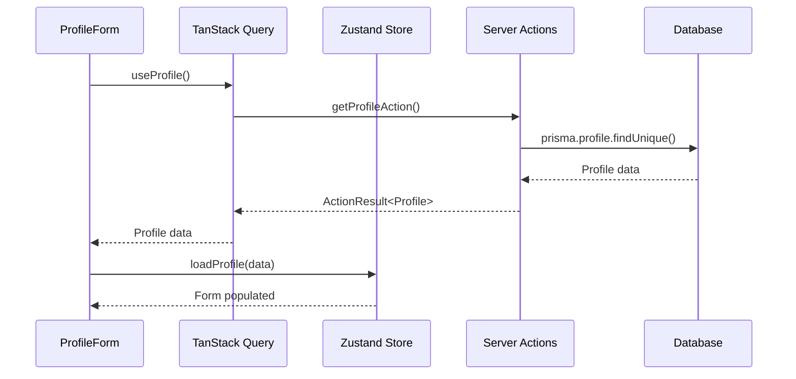
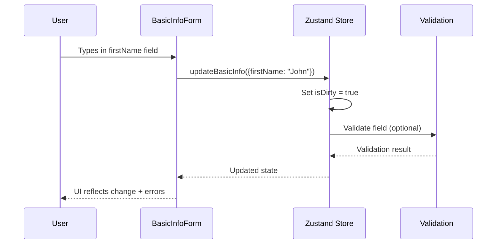
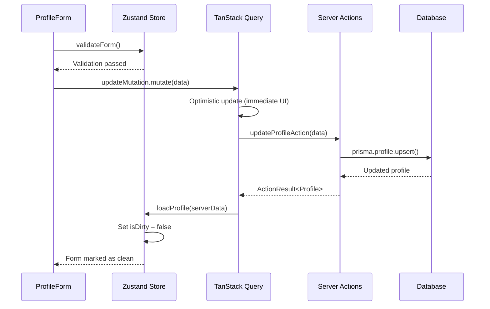

# Profile Form System Documentation

## Overview

The Profile Form System is a comprehensive multi-step form implementation that allows users to manage their profile information across five tabbed sections. It combines **TanStack Query** for server state management, **Zustand** for local form state, and **Server Actions** for data persistence.

## Architecture Overview

```
┌─────────────────┐    ┌──────────────────┐    ┌────────────────────┐
│   Profile UI    │◄──►│   Zustand Store  │◄──►│  TanStack Query    │
│   Components    │    │  (Form State)    │    │  (Server State)    │
└─────────────────┘    └──────────────────┘    └────────────────────┘
         │                       │                        │
         │                       │                        │
         ▼                       ▼                        ▼
┌─────────────────┐    ┌──────────────────┐    ┌────────────────────┐
│   Form Events   │    │   Validation     │    │   Server Actions   │
│   (User Input)  │    │   (Zod Schema)   │    │   (Database API)   │
└─────────────────┘    └──────────────────┘    └────────────────────┘
```

## Core Components

### 1. ProfileForm (Main Container)
**Location:** `app/(dashboard)/profile/_components/profile-form.tsx`

The main container component that orchestrates the entire form system.

**Key Responsibilities:**
- Manages tab navigation
- Handles form submission and saving
- Displays global form validation errors
- Shows save status and loading states
- Coordinates between Zustand store and TanStack Query

**Key Hooks Used:**
```typescript
const {
  profile, isDirty, errors, currentTab,
  loadProfile, setCurrentTab, setErrors, validateForm
} = useProfileStore();

const { data: serverProfile, isLoading } = useProfile();
const updateMutation = useUpdateProfile();
```

**Data Flow:**
1. **Initial Load:** Fetches profile data using TanStack Query
2. **Form Population:** Loads server data into Zustand store
3. **User Interaction:** Form changes update Zustand state
4. **Validation:** Real-time validation using Zod schemas
5. **Save:** Submits data via TanStack Query mutation

### 2. BasicInfoForm (Tab Component)
**Location:** `app/(dashboard)/profile/_components/basic-info-form.tsx`

Handles the first tab of the profile form containing personal information fields.

#### Fields Managed:
- `firstName` - User's first name
- `lastName` - User's last name  
- `email` - Email address with validation
- `phoneNumber` - Contact phone number
- `location` - User's location (City, State/Country)
- `website` - Personal website URL
- `linkedinUrl` - LinkedIn profile URL
- `githubUrl` - GitHub profile URL

#### How BasicInfoForm Works:

**1. State Connection:**
```typescript
const { profile, updateBasicInfo, errors } = useProfileStore();
```

**2. Input Handling:**
```typescript
const handleInputChange = (field: keyof BasicInfo, value: string) => {
  updateBasicInfo({ [field]: value });
};
```

**3. Real-time Updates:**
- Each input field has an `onChange` handler
- Changes immediately update the Zustand store
- Store marks form as "dirty" (`isDirty = true`)
- Validation errors are displayed in real-time

**4. Error Display:**
```typescript
const getFieldError = (field: string): string | undefined => {
  return errors[field]?.[0]; // Get first error for field
};
```

**5. Field Example:**
```typescript
<Input
  id="firstName"
  type="text"
  value={profile.firstName || ''}
  onChange={(e) => handleInputChange('firstName', e.target.value)}
  placeholder="Enter your first name"
  className={getFieldError('firstName') ? 'border-red-500' : ''}
/>
{getFieldError('firstName') && (
  <p className="text-sm text-red-600">{getFieldError('firstName')}</p>
)}
```

## State Management

### Zustand Store (Local Form State)
**Location:** `stores/profile-store.ts`

**Purpose:** Manages the form's local state while user is editing.

**Key State:**
```typescript
interface ProfileStore {
  profile: ProfileFormData;        // Current form data
  originalProfile: ProfileFormData; // Server data (for dirty checking)
  isDirty: boolean;               // Has form been modified?
  errors: Record<string, string[]>; // Validation errors
  currentTab: ProfileTab;         // Active tab
  isLoading: boolean;             // Loading states
  isSaving: boolean;              // Save in progress
}
```

**Key Actions:**
```typescript
// Basic info updates
updateBasicInfo: (data: Partial<BasicInfo>) => void;

// Array field management
addWorkExperience: (item: WorkExperience) => void;
updateWorkExperienceItem: (index: number, item: Partial<WorkExperience>) => void;
removeWorkExperience: (index: number) => void;

// Form management  
validateForm: () => boolean;
loadProfile: (data: ProfileFormData) => void;
resetForm: () => void;
```

### TanStack Query (Server State)
**Location:** `lib/profile-queries.ts`

**Purpose:** Manages server data fetching, caching, and synchronization.

**Key Hooks:**

**useProfile()** - Fetch profile data
```typescript
const { data: profile, isLoading, error } = useProfile();
```
- Automatically caches data for 5 minutes
- Shared across all components
- Background refetching when needed

**useUpdateProfile()** - Save profile data
```typescript
const updateMutation = useUpdateProfile();

updateMutation.mutate(formData, {
  onSuccess: (result) => { /* Handle success */ },
  onError: (error) => { /* Handle error */ }
});
```
- Optimistic updates (UI updates immediately)
- Automatic rollback on errors
- Cache invalidation after successful saves

**useCachedProfile()** - Get cached data without fetching
```typescript
const { profile, hasCache, isStale } = useCachedProfile();
```
- For headers, navigation, etc.
- No loading states
- Instant access to cached data

## Data Flow Detailed

### 1. Initial Page Load



### 2. User Input (BasicInfoForm)



### 3. Save Process



## Validation System

### Zod Schemas
**Location:** `lib/profile-schema.ts`

**Basic Info Schema:**
```typescript
export const basicInfoSchema = z.object({
  firstName: z.string().optional(),
  lastName: z.string().optional(),
  email: z.string().email('Invalid email format').optional().or(z.literal('')),
  phoneNumber: z.string().optional(),
  location: z.string().optional(),
  website: optionalUrl, // Custom helper for URL validation
  linkedinUrl: optionalUrl,
  githubUrl: optionalUrl,
});
```

**Validation Levels:**
1. **Field-level:** Real-time as user types (optional)
2. **Tab-level:** When switching tabs (optional)  
3. **Form-level:** Before saving (required)

### Error Handling

**Error Structure:**
```typescript
interface FormErrors {
  [fieldPath: string]: string[];
}

// Example:
{
  "firstName": ["First name is required"],
  "email": ["Invalid email format"],
  "workExperience.0.company": ["Company name is required"]
}
```

**Error Display:**
- Field-level errors show below each input
- Tab-level errors show red indicator on tab
- Form-level errors show in summary card
- Server errors handled via TanStack Query

## Key Features

### 1. Unsaved Changes Detection
- `isDirty` flag tracks if form has been modified
- Warning shown to user when navigating away
- Save button only enabled when changes exist

### 2. Tab Error Indicators  
```typescript
const getTabErrors = (tabId: ProfileTab): boolean => {
  const tabErrorKeys = Object.keys(errors);
  
  switch (tabId) {
    case 'basic':
      return tabErrorKeys.some(key => 
        ['firstName', 'lastName', 'email', '...'].includes(key)
      );
    // ... other tabs
  }
};
```

### 3. Optimistic Updates
- UI updates immediately when user saves
- If server request fails, changes are rolled back
- User gets instant feedback

### 4. Caching & Performance
- Profile data cached for 5 minutes
- Shared across all pages
- Background refetching when stale
- Prefetching on hover/navigation

## Usage Examples

### Adding a New Field to BasicInfoForm

1. **Update Type Definition** (`types/profile.ts`):
```typescript
export interface BasicInfo {
  // ... existing fields
  middleName?: string; // New field
}
```

2. **Update Zod Schema** (`lib/profile-schema.ts`):
```typescript
export const basicInfoSchema = z.object({
  // ... existing fields
  middleName: z.string().optional(),
});
```

3. **Add to BasicInfoForm Component**:
```typescript
<div className="space-y-2">
  <Label htmlFor="middleName">Middle Name</Label>
  <Input
    id="middleName"
    type="text"
    value={profile.middleName || ''}
    onChange={(e) => handleInputChange('middleName', e.target.value)}
    placeholder="Enter your middle name"
    className={getFieldError('middleName') ? 'border-red-500' : ''}
  />
  {getFieldError('middleName') && (
    <p className="text-sm text-red-600">{getFieldError('middleName')}</p>
  )}
</div>
```

4. **Update Database Schema** (if persisting):
   - Add column to Profile model in `schema.prisma`
   - Run Prisma migration

### Using Profile Data in Other Components

```typescript
// In a header component
import { useCachedProfile } from '../lib/profile-queries';

export function UserHeader() {
  const { profile, hasCache } = useCachedProfile();
  
  if (!hasCache || !profile) {
    return <div>Loading...</div>;
  }
  
  const fullName = `${profile.firstName} ${profile.lastName}`.trim();
  return <span>Welcome, {fullName}!</span>;
}
```

```typescript
// In a dashboard component  
import { useProfile } from '../lib/profile-queries';

export function ProfileSummary() {
  const { data: profile, isLoading, error } = useProfile();
  
  if (isLoading) return <div>Loading profile...</div>;
  if (error) return <div>Error loading profile</div>;
  
  return (
    <div>
      <h2>{profile?.firstName} {profile?.lastName}</h2>
      <p>Email: {profile?.email}</p>
      {/* etc */}
    </div>
  );
}
```

## Troubleshooting

### Common Issues

**1. Form not saving**
- Check network tab for API errors
- Verify server actions are properly configured
- Check validation errors in Zustand store

**2. Data not loading**
- Verify TanStack Query provider is set up
- Check server action implementation
- Verify database connection

**3. Validation errors**
- Check Zod schema definitions
- Verify error handling in components
- Check form data structure

**4. State synchronization issues**
- Ensure single source of truth (don't duplicate state)
- Check useEffect dependencies
- Verify TanStack Query cache keys

### Debug Tools

1. **TanStack Query Devtools** - Inspect cache state
2. **Zustand Devtools** - Monitor store changes  
3. **React DevTools** - Component state inspection
4. **Network Tab** - Server action requests

## Performance Considerations

1. **Debounce validation** for expensive operations
2. **Memoize components** that don't change often
3. **Use React.memo** for form field components
4. **Optimize re-renders** with proper dependency arrays
5. **Consider virtualization** for large lists (work experience, etc.)

## Future Enhancements

1. **Auto-save** functionality
2. **Draft recovery** from localStorage
3. **Multi-user collaboration** features
4. **Form field history/undo**
5. **Bulk import/export** capabilities
6. **Advanced validation** with async rules
7. **Form analytics** and completion tracking