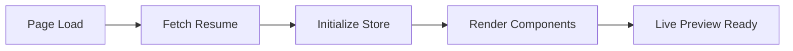
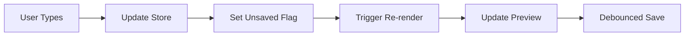
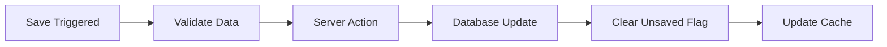

# Resume Editor System Documentation

## Overview

The Resume Editor System is a comprehensive, real-time resume editing platform built with Next.js, Zustand, and TanStack Query. It provides users with an intuitive interface to create, edit, and preview professional resumes with live updates and automatic change detection.

## Architecture

### Core Components

```
┌─────────────────────────────────────────────────────────────┐
│                    Resume Editor System                     │
├─────────────────────────────────────────────────────────────┤
│  Frontend Layer                                             │
│  ┌─────────────────┐  ┌─────────────────┐  ┌─────────────┐ │
│  │   Edit Panel    │  │  Preview Panel  │  │ Action Btns │ │
│  │                 │  │                 │  │             │ │
│  │ • Basic Info    │  │ • Live Preview  │  │ • Save      │ │
│  │ • Work Exp      │  │ • A4 Scaling   │  │ • Import    │ │
│  │ • Skills        │  │ • Real-time    │  │ • Download  │ │
│  │ • Education     │  │   Updates      │  │             │ │
│  │ • Projects      │  │                 │  │             │ │
│  └─────────────────┘  └─────────────────┘  └─────────────┘ │
├─────────────────────────────────────────────────────────────┤
│  State Management (Zustand)                                │
│  ┌─────────────────────────────────────────────────────────┐ │
│  │                Resume Editor Store                      │ │
│  │  • Current resume data                                  │ │
│  │  • Unsaved changes tracking                            │ │
│  │  • Auto-save state                                     │ │
│  │  • Section-specific selectors                          │ │
│  └─────────────────────────────────────────────────────────┘ │
├─────────────────────────────────────────────────────────────┤
│  Data Layer                                                 │
│  ┌─────────────────┐  ┌─────────────────┐  ┌─────────────┐ │
│  │  TanStack Query │  │  Server Actions │  │  Database   │ │
│  │                 │  │                 │  │             │ │
│  │ • Data fetching │  │ • CRUD          │  │ • PostgreSQL│ │
│  │ • Caching       │  │ • Validation    │  │ • Prisma    │ │
│  │ • Optimistic    │  │ • Error         │  │ • Supabase  │ │
│  │   updates       │  │   handling      │  │             │ │
│  └─────────────────┘  └─────────────────┘  └─────────────┘ │
└─────────────────────────────────────────────────────────────┘
```

## Key Features

### 1. Real-time Editing
- **Instant Preview Updates**: Changes reflect immediately in the preview panel
- **No Manual Refresh**: Preview updates automatically as user types
- **Optimistic UI**: Changes appear instantly, then sync to server

### 2. State Management
- **Zustand Store**: Centralized state management for all resume data
- **Change Tracking**: Automatic detection of unsaved changes
- **Section Isolation**: Each resume section has its own update methods

### 3. Navigation Protection
- **Unsaved Changes Warning**: Alerts users before navigating away with unsaved changes
- **Multiple Navigation Types**: Covers browser refresh, back/forward, and route changes
- **Visual Indicators**: Clear UI feedback showing unsaved state

### 4. Data Persistence
- **Auto-save**: Debounced saving to prevent data loss
- **Profile Integration**: Import existing profile data into resumes
- **Conflict Resolution**: Handles concurrent editing scenarios

## File Structure

```
apps/resume/
├── app/(dashboard)/resume/[id]/
│   ├── page.tsx                    # Main resume editor page
│   └── _components/
│       ├── basic-info-content.tsx  # Basic information form
│       ├── work-content.tsx        # Work experience editor
│       ├── html-preview-panel.tsx  # Live preview component
│       ├── info-accordion.tsx      # Section navigation
│       ├── editor-actions-buttons.tsx # Save/import/export buttons
│       └── resume-creator.tsx      # Main editor layout
├── stores/
│   └── resume-editor-store.ts      # Zustand state management
├── hooks/
│   ├── queries/
│   │   ├── profile-queries.ts      # Profile data queries
│   │   └── resume-queries.ts       # Resume CRUD queries
│   └── use-unsaved-changes.ts      # Navigation protection hook
├── actions/resume/
│   ├── create-resume.ts            # Create resume server action
│   ├── update-resume.ts            # Update resume server action
│   ├── get-resume.ts               # Fetch resume server action
│   └── delete-resume.ts            # Delete resume server action
├── types/
│   ├── resume.ts                   # Resume type definitions
│   └── profile.ts                  # Profile type definitions
└── docs/
    └── resume-editor-system.md     # This documentation
```

## Data Flow

### 1. Initial Load


### 2. User Interaction


### 3. Save Process


## API Reference

### Store Actions

#### `updateBasicInfo(info: Partial<BasicInfo>)`
Updates basic contact information
```typescript
updateBasicInfo({
  firstName: "John",
  lastName: "Doe",
  email: "john@example.com"
});
```

#### `updateWorkExperience(experiences: WorkExperience[])`
Updates work experience array
```typescript
updateWorkExperience([
  {
    id: "1",
    company: "TechCorp",
    position: "Senior Developer",
    location: "NYC",
    date: "2020 - Present",
    description: ["Built scalable apps", "Led team of 5"],
    technologies: ["React", "Node.js"]
  }
]);
```

#### `saveToDatabase()`
Manually trigger save to database
```typescript
await saveToDatabase();
```

### Store Selectors

#### `useResumeData()`
Returns complete resume object
```typescript
const resume = useResumeData();
```

#### `useHasUnsavedChanges()`
Returns boolean indicating unsaved changes
```typescript
const hasChanges = useHasUnsavedChanges();
```

#### `useResumeBasicInfo()`
Returns basic info with optimized re-renders
```typescript
const basicInfo = useResumeBasicInfo();
```

## Usage Examples

### Creating a New Section Editor

```typescript
export function ProjectsEditor() {
  const projects = useResumeProjects();
  const updateProjects = useResumeEditorStore(s => s.updateProjects);
  
  const handleAddProject = (project: Project) => {
    updateProjects([...projects, project]);
  };
  
  return (
    <div>
      {projects.map(project => (
        <ProjectCard key={project.id} project={project} />
      ))}
      <AddProjectButton onClick={handleAddProject} />
    </div>
  );
}
```

### Adding Navigation Protection

```typescript
export function MyFormPage() {
  const hasChanges = useHasUnsavedChanges();
  
  useUnsavedChanges(hasChanges, {
    message: "You have unsaved changes. Continue?"
  });
  
  return <MyForm />;
}
```

## Best Practices

### 1. State Updates
- Always use store actions for updates
- Never mutate store state directly
- Use specific selectors to minimize re-renders

### 2. Form Handling
- Use controlled components with store values
- Debounce rapid updates for performance
- Validate data before saving

### 3. Error Handling
- Always handle server action errors
- Provide user feedback for failures
- Implement retry mechanisms for network issues

### 4. Performance
- Use specific selectors instead of full store
- Implement virtual scrolling for large lists
- Lazy load non-critical sections

## Troubleshooting

### Common Issues

#### Store not updating
```typescript
// ❌ Wrong - direct mutation
state.resume.firstName = "John";

// ✅ Correct - use action
updateBasicInfo({ firstName: "John" });
```

#### Infinite re-renders
```typescript
// ❌ Wrong - new object every render
const basicInfo = useResumeEditorStore(state => ({
  firstName: state.resume?.firstName,
  lastName: state.resume?.lastName
}));

// ✅ Correct - use provided selector
const basicInfo = useResumeBasicInfo();
```

#### Navigation warnings not working
- Check if `hasUnsavedChanges` is correctly connected
- Verify hook is called in client component
- Ensure router is properly imported

### Debug Tools

#### Store State Inspection
```typescript
// Add temporary debug logging
const store = useResumeEditorStore();
console.log('Store state:', store);
```

#### Change Tracking
```typescript
const hasChanges = useHasUnsavedChanges();
console.log('Has unsaved changes:', hasChanges);
```

## Future Enhancements

### Planned Features
- [ ] Drag-and-drop section reordering
- [ ] Version history and rollback
- [ ] Real-time collaboration
- [ ] Advanced PDF export with custom templates
- [ ] AI-powered content suggestions
- [ ] Integration with job application platforms

### Technical Improvements
- [ ] Implement proper conflict resolution
- [ ] Add comprehensive error boundaries
- [ ] Optimize bundle size with code splitting
- [ ] Add comprehensive test coverage
- [ ] Implement accessibility improvements

## Support

For questions or issues with the resume editor system:

1. Check this documentation first
2. Review the existing code examples
3. Test with minimal reproduction cases
4. Check browser console for errors

## Changelog

### Version 1.0.0 (Current)
- Initial implementation with core editing features
- Real-time preview with A4 scaling
- Zustand state management
- Navigation protection
- Basic info and work experience editors
- Auto-save functionality